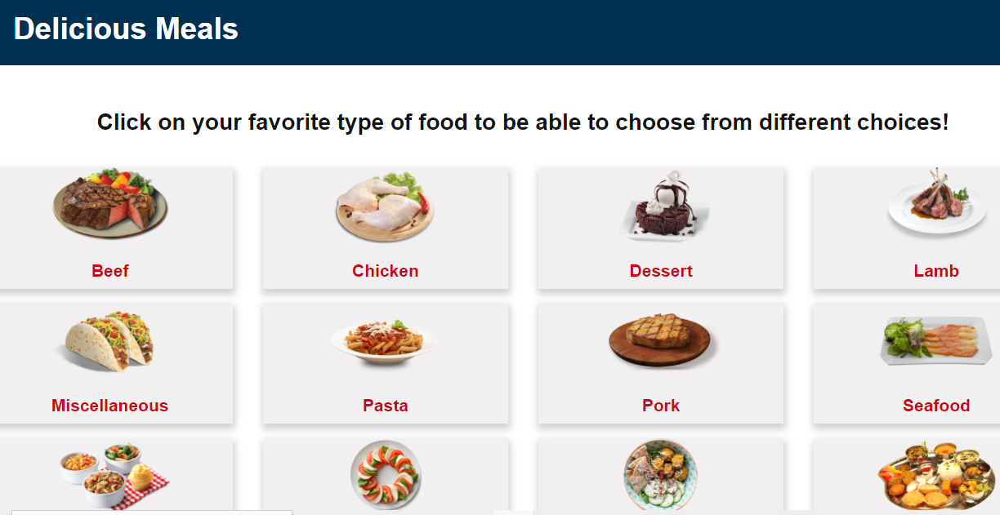
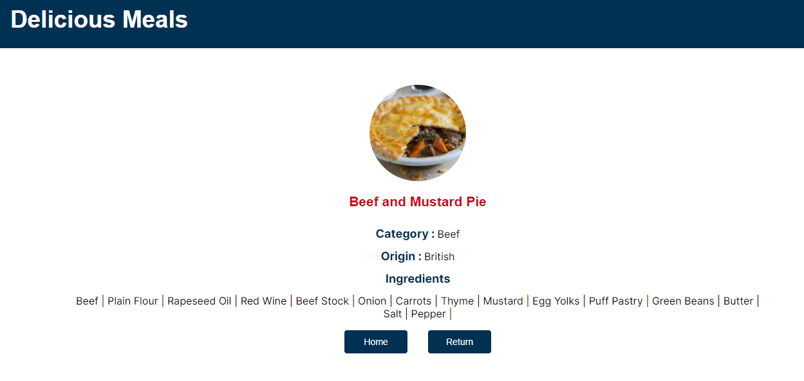

# Meals Catalogue

This is a React- Redux based meals catalogue application it consists of a browsable list of foods that you can filter and access to the details of one specific type of food.

### List of foods



### One type of food



## Live Demo

Check the application live [Here](lydia-meals-catalogue.netlify.app)

## Available Commands

| Command | Description |
|---------|-------------|
| `npm install` | Install project dependencies |
| `npm start` | Build project and open web server running project |
| `npm run build` | Builds code bundle with production settings (minification, uglification, etc..) |

## Getting Started

* Clone this repo
    ```
    git clone https://github.com/DeliceLydia/meals-catalogue.git
    ```
* Navigate to meals-catalogue folder
    ```
    cd meals-catalogue
    ```
* On the terminal, while in the 'meals-catalogue' directory:

* Run ``` git checkout feature-branch ```

* Run ``` git pull origin feature-branch ```

* Run ``` npm install ``` to install dependencies

* Start the server by running ``` npm start ```
   
* The server would usually start on port:3000

## Built with

- HTML
- CSS
- Javascript
- React
- Redux
- Netlify

## Tested with

- Jest

## Author

👤 **Delice Lydia**
  - GitHub: [Delice Lydia](https://github.com/DeliceLydia)
  - Twitter: [Delice](https://twitter.com/IngabireLydia3)
  - LinkedIn: [Delice Lydia](https://www.linkedin.com/in/delice-lydia/)

## Contribution

- Clone the repo using the above instructions
- Create a new branch: `git checkout -b awesome branch`
- Add your changes and commit the file
- Push to your forked repo
- Make a pull request to `develop` branch

## Acknowledgments

Massive thanks to [Marc-Antoine Roy on Behance](https://www.behance.net/enfantroy) for sharing his [Design](https://www.behance.net/gallery/11351281/NomNom) idea

## Show your support

Give a ⭐️ if you like 

## 📝 License

This project is [MIT](https://github.com/DeliceLydia/meals-catalogue/blob/main/LICENSE) licensed.
